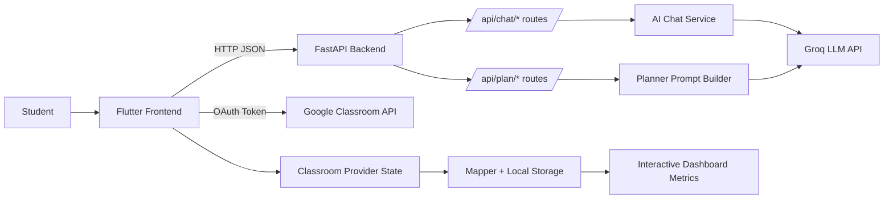
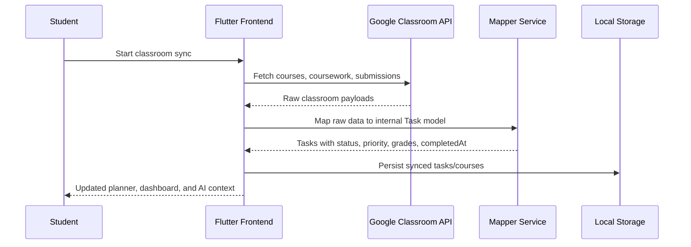

# UpGrade

UpGrade is an AI-powered study assistant that combines Google Classroom sync, task planning, AI chat support, and progress analytics in one student-focused system.

This README documents the full project architecture, system workflows, and repository structure.

## Diagram Pack

- Full architecture, workflow, and structure diagrams: [docs/WEB_APP_ARCHITECTURE.md](docs/WEB_APP_ARCHITECTURE.md)

## Table of Contents

1. Project Summary
2. Core Features
3. System Architecture
4. System Workflow
5. System Structure
6. API Surface (Current Mounted Routes)
7. Configuration and Environment
8. Run and Deployment
9. Testing
10. Troubleshooting

## Project Summary

UpGrade helps students:

- sync assignments from Google Classroom
- track pending, missed, and completed work
- generate AI study plans
- chat with an AI study assistant
- monitor progression and productivity using an interactive dashboard

The system is organized into three major parts:

- frontend app: Flutter client (mobile/web/desktop)
- backend API: FastAPI server
- AI layer: Groq-backed LLM services for chat and planning

## Core Features

- Daily planner and weekly schedule
- Google Classroom sync and mapping to internal task model
- AI chat assistant with context-aware responses
- AI study plan generation from real student tasks
- Interactive progress dashboard with progression insights
- Manual course/task support for mixed workflows

## System Architecture

### High-Level Architecture



### Layer Responsibilities

#### Frontend (Flutter)

- UI, navigation, and state management
- syncs classroom data and stores mapped tasks locally
- calls backend for AI chat and plan generation
- renders interactive analytics from task data

Key files:

- frontend/lib/app.dart
- frontend/lib/services/api_service.dart
- frontend/lib/providers/classroom_provider.dart
- frontend/lib/services/classroom_sync_service.dart
- frontend/lib/services/classroom_mapper_service.dart
- frontend/lib/screens/progress_dashboard_screen.dart
- frontend/lib/services/dashboard_metrics_service.dart

#### Backend (FastAPI)

- exposes REST endpoints for AI features
- validates payloads and shapes responses
- builds planner prompts and parses structured AI output

Key files:

- backend/app/main.py
- backend/app/api/routes/chat.py
- backend/app/api/routes/planner.py

#### AI Layer

- wraps Groq chat completion API
- builds AI chat context from student/task metadata
- supports planner generation logic used by backend routes

Key files:

- ai/chat_service.py
- ai/planner_llm/llm_client.py

## System Workflow

### A. Student Data Ingestion Workflow



### B. AI Chat Workflow

1. Frontend sends message, conversation history, and student context to `POST /api/chat/message`.
2. Backend route delegates to `AIChatService`.
3. AI service builds system prompt + context block + recent history.
4. Groq LLM is called through `GroqClient.chat_completion(...)`.
5. Backend returns structured response (`success`, `message`, `model`, `suggestions`).

Related files:

- frontend/lib/services/api_service.dart
- backend/app/api/routes/chat.py
- ai/chat_service.py
- ai/planner_llm/llm_client.py

### C. AI Study Plan Workflow

1. Frontend sends active tasks to `POST /api/plan/generate`.
2. Backend filters and sorts tasks by urgency/deadline.
3. Backend builds a strict JSON-only planner prompt.
4. Groq is called and response content is parsed as JSON.
5. Frontend renders summary + per-task plan cards.

Related files:

- frontend/lib/services/api_service.dart
- backend/app/api/routes/planner.py
- ai/planner_llm/llm_client.py

### D. Progress Dashboard Workflow

1. Dashboard reads current task set from `ClassroomProvider`.
2. `DashboardMetricsService` computes progression and trend metrics.
3. UI applies date-range and course filters.
4. Interactive charts support tooltips and day drill-down details.

Related files:

- frontend/lib/screens/progress_dashboard_screen.dart
- frontend/lib/services/dashboard_metrics_service.dart
- frontend/lib/models/dashboard_stats.dart

## System Structure

The project is organized by domain and runtime role:

```text
UpGrade/
├─ ai/
│  ├─ chat_service.py
│  ├─ planner_llm/
│  │  └─ llm_client.py
│  └─ requirements.txt
├─ backend/
│  ├─ app/
│  │  ├─ main.py
│  │  ├─ api/routes/
│  │  │  ├─ chat.py
│  │  │  └─ planner.py
│  │  ├─ models/
│  │  ├─ schemas/
│  │  ├─ services/
│  │  └─ utils/
│  ├─ requirements.txt
│  └─ Dockerfile
├─ frontend/
│  ├─ lib/
│  │  ├─ app.dart
│  │  ├─ core/
│  │  ├─ models/
│  │  ├─ providers/
│  │  ├─ screens/
│  │  ├─ services/
│  │  └─ widgets/
│  ├─ pubspec.yaml
│  └─ Dockerfile
├─ docker-compose.yml
├─ run-all.ps1
├─ run-backend.ps1
├─ run-frontend.ps1
└─ RUN.md
```

## API Surface (Current Mounted Routes)

From `backend/app/main.py`, the currently mounted routers are `chat` and `planner` under `/api`.

### Health

- GET `/`
- GET `/health`
- GET `/api/health`

### Chat

- POST `/api/chat/message`
- GET `/api/chat/suggestions`
- GET `/api/chat/health`

### Planner

- POST `/api/plan/generate`
- GET `/api/plan/health`

## Configuration and Environment

### Required environment variables

Use environment files in:

- backend/.env
- ai/.env

Expected keys:

- `LLM_PROVIDER` (example: `groq`)
- `GROQ_API_KEY`
- `GROQ_API_BASE`
- `GROQ_MODEL`
- optional tuning values like `TIMEOUT`, `TEMPERATURE`, `MAX_TOKENS`

### Security note

- Never commit real API keys.
- Rotate any exposed key immediately.
- Keep `.env` files out of git history.

## Run and Deployment

### Local development (recommended)

1. Start everything with one command:

```powershell
.\run-all.ps1
```

2. Or run separately:

```powershell
.\run-backend.ps1
.\run-frontend.ps1
```

Local defaults:

- backend: `http://127.0.0.1:8001`
- frontend API base URL is configured in `frontend/lib/services/api_service.dart`

### Docker deployment

```powershell
docker compose up --build
```

Docker defaults:

- backend exposed on `8000`
- frontend exposed on `80`

Important: if running frontend outside Docker, ensure backend port configuration matches the frontend `baseUrl`.

## Testing

Available integration scripts:

- `test_integration.py`
- `test_llama_integration.py`

Run from project root:

```powershell
python test_integration.py
python test_llama_integration.py
```

## Troubleshooting

### Chat feels static or not AI-generated

- verify backend is running and reachable on configured port
- check `/api/chat/health`
- verify Groq key and connectivity

### Study plan generation fails

- check `/api/plan/health`
- inspect backend logs for JSON parse/Groq errors
- verify task payload fields and LLM availability

### Frontend cannot reach backend

- confirm `baseUrl` in `frontend/lib/services/api_service.dart`
- ensure port alignment between local scripts (`8001`) and Docker (`8000`)

---

For script-specific startup details, see `RUN.md`.


