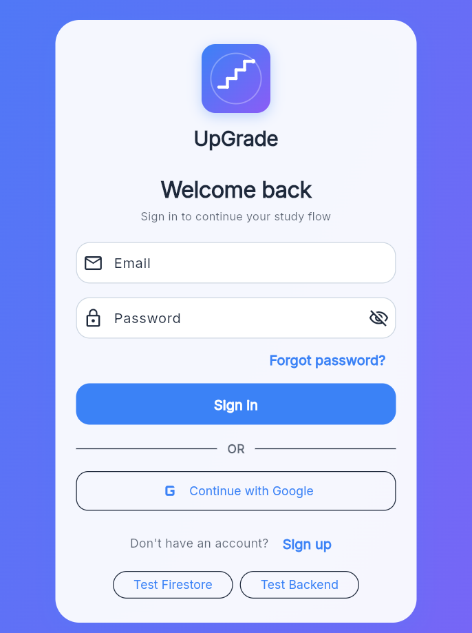
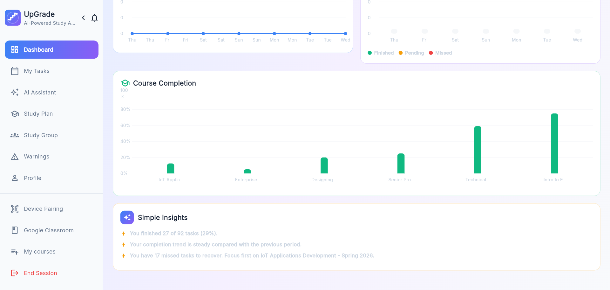
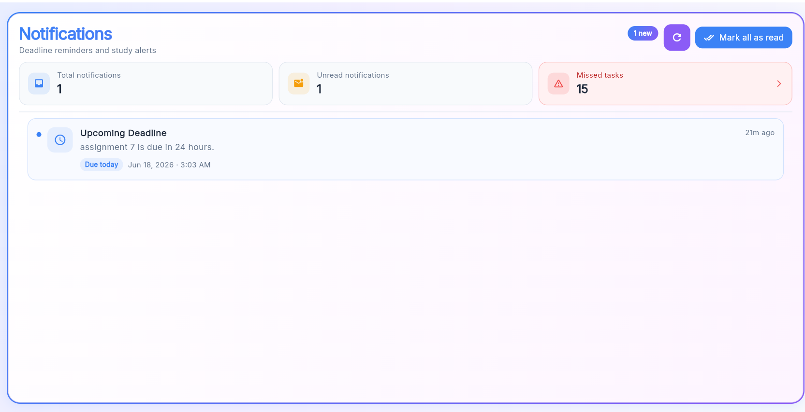
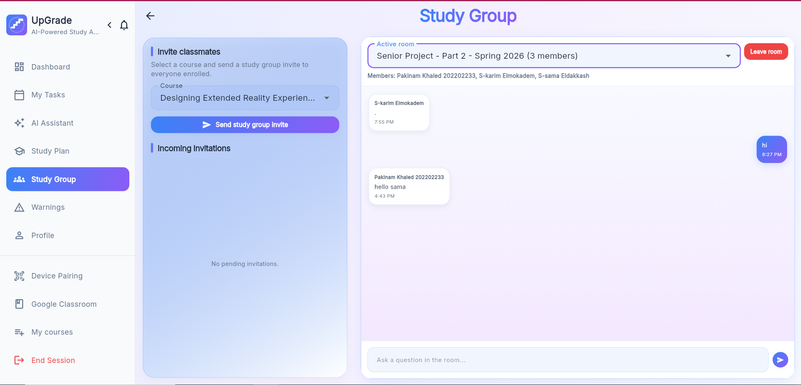
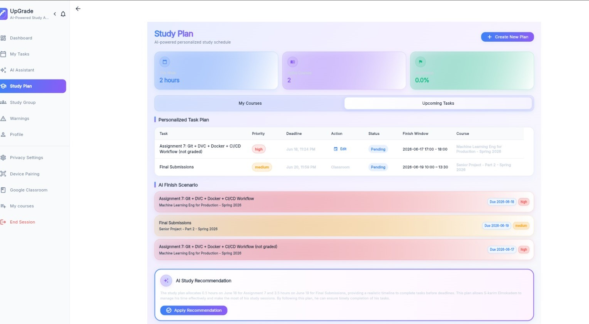

# UpGrade – AI-Powered Personalized Study Planner

**UpGrade** is a smart study planning system that helps students manage assignments, synchronize tasks from Google Classroom, generate personalized study plans using AI, track progress, receive reminders, and collaborate in study groups. The project combines a cross-platform Flutter client with a FastAPI backend and modern cloud services to deliver an intelligent, student-centered learning experience.

---

## Team Members

| Name           | ID        | Program |
|----------------|-----------|---------|
| Karim  Wael    | 202202212 | DSAI    |
| Pakinam Khaled | 202202233 | SWD     |
| Sama Reda      | 202202246 | SWD     |


---

## Supervisor

**Dr. / Prof. Mayada Houdod**

---

## Problem Statement

University and school students frequently face overlapping deadlines, inconsistent schedules, and fragmented workflows across multiple platforms. Assignments may be posted in Google Classroom while personal notes and reminders live elsewhere, making it difficult to maintain a single, reliable view of academic workload.

Common challenges include:

- **Task overload** — too many assignments competing for limited time
- **Missed deadlines** — poor visibility into upcoming due dates
- **Poor time management** — difficulty prioritizing work effectively
- **Scattered assignments** — tasks spread across classroom tools, email, and messaging apps
- **Lack of personalized guidance** — generic planners that do not adapt to individual study habits, workload, or performance

UpGrade addresses these problems by centralizing academic tasks, integrating with Google Classroom, and using AI to produce adaptive study plans, reminders, and progress insights tailored to each student.

---

## Features

- **User registration and login** — secure account creation and authentication via Firebase
- **Google Classroom integration** — connect a Google account and access course data
- **Assignment/task synchronization** — import and keep classroom assignments up to date
- **AI personalized study plan generation** — create daily and weekly plans based on tasks and priorities
- **Missed task rescheduling** — recover from incomplete work with intelligent replanning
- **Deadline reminders and notifications** — stay informed before important due dates
- **Dashboard and progress analytics** — visualize productivity, completion rates, and trends
- **Study group chat** — collaborate with peers in real time through shared study groups
- **Task Management** — create, organize, and track task status throughout the study lifecycle
- **QR code support for opening web links** — quickly open supported URLs from mobile or web

---

## System Architecture

UpGrade follows a three-tier architecture consisting of a Flutter client layer, a FastAPI backend layer, and external cloud services.

### Presentation Layer

The frontend is built using Flutter and supports both Web and Mobile platforms. The client provides user interfaces for task management, study planning, analytics, notifications, and study groups. To improve responsiveness and reduce unnecessary network requests, user-specific data such as courses and tasks are cached locally using SharedPreferences.

### Application Layer

The backend is implemented using FastAPI and is responsible for:

- Business logic processing
- Task management
- Study plan generation
- Notification handling
- Google Classroom synchronization
- AI service integration

### Data & Service Layer

The system integrates with multiple external services:

- Firebase Authentication for secure user authentication and identity management.
- Firebase Firestore for real-time collaborative features such as study groups and device pairing.
- Google Classroom API as the primary source of course and assignment data.
- Groq API (Llama 3.3) for AI-powered study planning and chat assistance.
- SQLite for backend persistence of tasks, notifications, and activity records.

### Architecture Flow

User

↓

Flutter Web / Mobile Client

↓

FastAPI Backend

↓

Firebase Services + Google Classroom API + Groq AI Services + SQLite Database

↓

Personalized Study Plans, Notifications, Analytics, and Study Group Collaboration

### Deployment Overview

| Component   | Technology / Platform      |
|-------------|----------------------------|
| Frontend    | Flutter Web / Mobile, Firebase Hosting |
| Backend     | FastAPI on Render          |
| Auth        | Firebase Authentication    |
| Real-time   | Firebase Firestore         |
| Local DB    | SQLite                     |
| AI          | Groq API (Llama 3.3)       |
| Integration | Google Classroom API       |

---

## Technologies Used

### Frontend
- Flutter
- Dart

### Backend
- FastAPI
- Python

### Database
- SQLite
- Firebase Firestore

### Authentication
- Firebase Authentication

### AI / ML
- Groq API
- Llama 3.3

### Cloud Services
- Firebase
- Render

### DevOps / Testing
- GitHub
- Pytest
- Locust
- Swagger / OpenAPI

---

## Setup Instructions

### 1. Clone the repository

```bash
git clone <repository-url>
cd UpGrade
```

### 2. Backend setup

```bash
cd backend
python -m venv venv
```

**Windows:**

```bash
venv\Scripts\activate
```

**macOS / Linux:**

```bash
source venv/bin/activate
```

```bash
pip install -r requirements.txt
```

Create a `.env` file inside the `backend` directory with the required environment variables:

```env
LLM_PROVIDER=groq
GROQ_API_KEY=your_groq_api_key
GROQ_API_BASE=https://api.groq.com/openai/v1
GROQ_MODEL=llama-3.3-70b-versatile

TIMEOUT=90
TEMPERATURE=0.5
MAX_TOKENS=1024
stream=True
```

Start the FastAPI server:

```bash
uvicorn app.main:app --reload --host 127.0.0.1 --port 8001
```

API documentation is available at: `http://127.0.0.1:8001/docs`

### 3. Frontend setup

Open a new terminal from the project root:

```bash
cd frontend
flutter pub get
flutter run -d chrome --web-port=5000
```

Then open the app in your browser at: `http://localhost:5000`

> **Note:** For Google OAuth during local development, use `localhost` rather than `127.0.0.1` to avoid origin mismatch errors. Ensure your OAuth client in Google Cloud Console includes `http://localhost:5000` as an authorized origin.

---

## Deployment Instructions

### Backend (Render)

1. Sign in to [Render](https://render.com) and connect your GitHub repository.
2. Create a new **Web Service** and select the repository.
3. Set the **Root Directory** to `backend`.
4. Configure the build and start commands, for example:
   - **Build command:** `pip install -r requirements.txt`
   - **Start command:** `uvicorn app.main:app --host 0.0.0.0 --port $PORT`
5. Add the required environment variables (e.g., `GROQ_API_KEY`, `GROQ_MODEL`, and any SMTP or notification settings).
6. Deploy the service and copy the generated backend URL for frontend configuration.

### Frontend (Firebase Hosting)

1. Install the Firebase CLI and log in to your Firebase project.
2. Build the Flutter web application:

```bash
cd frontend
flutter build web
```

3. Configure `firebase.json` for hosting (public directory, rewrites, and ignore rules as needed).
4. Deploy to Firebase Hosting:

```bash
firebase deploy
```

5. Use the public URL generated by Firebase Hosting as the live application link.

---

## Usage Guide

1. **Create an account or log in** — register with email/password or sign in through the supported authentication flow.
2. **Connect Google Classroom** — authorize UpGrade to access your courses and assignments.
3. **Sync assignments** — import classroom tasks into the app and keep your task list current.
4. **Generate a study plan** — request an AI-powered plan based on deadlines, priorities, and available study time.
5. **View tasks and dashboard** — monitor upcoming work, completed items, streaks, and analytics.
6. **Mark tasks as completed** — update progress as you finish assignments and sessions.
7. **Receive notifications** — get reminders for approaching deadlines and important updates.
8. **Join or create study groups** — collaborate with classmates through group chat and shared workflows.
9. **Use the QR scanner** — scan supported QR codes to open web links quickly within the app.

---

## Screenshots / Demo

### Login Screen



### Dashboard



### Notifications



### Study Groups



### Study Planner



### Live Demo

<https://upgrade-e87b3.web.app>

### Repository

<https://github.com/s-pakinamkhaled/UpGrade>

---

## Testing and Evaluation

UpGrade includes a structured testing strategy to validate correctness, reliability, and performance before and after deployment.

| Test Type              | Tool / Method        | Purpose                                      |
|------------------------|----------------------|----------------------------------------------|
| Unit testing           | Pytest               | Verify individual backend modules and APIs   |
| Integration testing    | Pytest               | Validate end-to-end flows across components  |
| API testing            | Swagger / OpenAPI    | Manually inspect and test REST endpoints     |
| Performance testing    | Locust               | Measure behavior under concurrent user load  |
| Coverage reporting     | pytest-cov             | Track test coverage across the backend       |

### Testing Results

- Unit Tests: Passed
- Integration Tests: Passed
- API Testing: Completed using Swagger
- Code Coverage: 42%
- Performance Testing: 500 Concurrent Users
- Failure Rate: 0%
- Average Response Time: 3960 ms

**Example commands:**

```bash
# Run backend unit and integration tests
python -m pytest backend/tests/ -v

# Run tests with coverage report
python -m pytest backend/tests/ --cov=app --cov-report=term-missing

# Run Locust performance tests (backend must be running)
cd backend
locust -f load_tests/locustfile.py --host http://127.0.0.1:8001
```

These tests help ensure system correctness, stability, and acceptable performance under multiple concurrent users, which is essential for a production-ready graduation project.

---


## License / Notes

This project was developed as a graduation project for academic purposes.

---

**UpGrade** — Intelligent planning for smarter studying.
