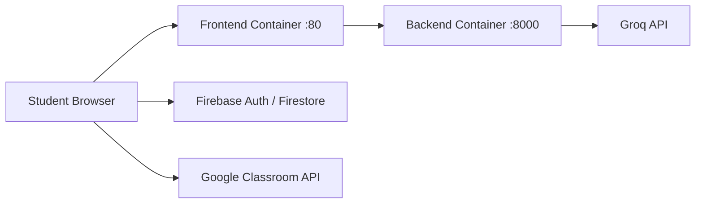

# UpGrade Full Diagrams

This document provides three complete visual diagrams for the project:

1. Full architecture diagram
2. Full workflow diagram
3. Full project structure diagram

## 1) Full Architecture Diagram

```mermaid
flowchart LR
    U[Student] --> B[Web Browser]

    subgraph FE[Frontend - Flutter Web]
        UI[UI Screens\nDaily Planner | AI Chat | Progress Dashboard | Study Plan]
        ST[State Providers\nClassroomProvider | DashboardShellProvider | SettingsProvider]
        SVC[Client Services\napi_service | classroom_sync_service | classroom_mapper_service | dashboard_metrics_service]
        LS[Local Storage\nSharedPreferences]

        UI --> ST --> SVC
        SVC --> LS
    end

    subgraph BE[Backend - FastAPI]
        MAIN[backend/app/main.py\nCORS + Router Mounting + Health]
        CHAT[API Router\n/api/chat/message\n/api/chat/suggestions\n/api/chat/health]
        PLAN[API Router\n/api/plan/generate\n/api/plan/health]

        MAIN --> CHAT
        MAIN --> PLAN
    end

    subgraph AI[AI Layer]
        CS[ai/chat_service.py\nAIChatService]
        LLM[ai/planner_llm/llm_client.py\nGroqClient / GroqLLMClient]

        CS --> LLM
    end

    subgraph EXT[External Systems]
        GC[Google Classroom API]
        GQ[Groq LLM API]
        FA[Firebase Auth]
        FS[Cloud Firestore]
    end

    B --> UI
    UI -->|Login and identity| FA
    UI -->|Pairing or profile workflows| FS

    SVC -->|OAuth token and REST calls| GC
    UI -->|HTTP JSON requests| MAIN

    CHAT --> CS
    PLAN --> LLM
    LLM -->|LLM inference| GQ
```

## 2) Full Workflow Diagram

```mermaid
flowchart TD
    START([Student opens UpGrade web app]) --> AUTH{Authenticated?}

    AUTH -- No --> LOGIN[Login or Register]\nusing Firebase Auth
    LOGIN --> AUTH

    AUTH -- Yes --> LOAD[Load local courses and tasks\nfrom SharedPreferences]

    LOAD --> SYNCQ{Sync Google Classroom now?}

    SYNCQ -- Yes --> OAUTH[Get Google OAuth token\nclassroom scopes]
    OAUTH --> FETCH[Fetch courses, courseWork,\nstudentSubmissions]
    FETCH --> MAP[Map raw payloads to Task model\nstatus, priority, grades, completedAt]
    MAP --> SAVE[Persist synced data locally]
    SAVE --> READY[Data ready in ClassroomProvider]

    SYNCQ -- No --> READY

    READY --> ACTION{Student action}

    ACTION --> CHATPATH[AI Chat]
    ACTION --> PLANPATH[AI Study Plan]
    ACTION --> DASHPATH[Progress Dashboard]

    CHATPATH --> CHATREQ[POST /api/chat/message\nmessage + history + student context]
    CHATREQ --> CHATLLM[Backend chat route -> AIChatService -> Groq]
    CHATLLM --> CHATRESP[Response + suggestions]
    CHATRESP --> READY

    PLANPATH --> PLANREQ[POST /api/plan/generate\nactive tasks payload]
    PLANREQ --> PLANLLM[Backend planner route\nfilter, sort, prompt, Groq]
    PLANLLM --> PLANRESP[Structured plan JSON returned]
    PLANRESP --> READY

    DASHPATH --> METRICS[DashboardMetricsService computes\nprogression and productivity]
    METRICS --> CHARTS[Interactive cards and charts\nfilter by time range and course]
    CHARTS --> READY
```

## 3) Full Project Structure Diagram

```mermaid
flowchart TD
    ROOT[UpGrade]

    ROOT --> AI[ai]
    AI --> AIENV[.env]
    AI --> AICHAT[chat_service.py]
    AI --> AILLM[planner_llm/llm_client.py]
    AI --> AIREQ[requirements.txt]

    ROOT --> BE[backend]
    BE --> BEDOCKER[Dockerfile]
    BE --> BEREQ[requirements.txt]
    BE --> BEAPP[app]

    BEAPP --> BEMAIN[main.py]
    BEAPP --> BEAPI[api/routes]
    BEAPI --> BERCHAT[chat.py]
    BEAPI --> BERPLAN[planner.py]
    BEAPI --> BEROTHER[auth.py | classroom.py | tasks.py]
    BEAPP --> BEMODELS[models]
    BEAPP --> BESCHEMAS[schemas]
    BEAPP --> BESERVICES[services]
    BEAPP --> BEUTILS[utils]
    BEAPP --> BEWORKERS[workers]

    ROOT --> FE[frontend]
    FE --> FEPUB[pubspec.yaml]
    FE --> FEDOCKER[Dockerfile]
    FE --> FELIB[lib]

    FELIB --> FEAPP[app.dart | main.dart]
    FELIB --> FECORE[core]
    FELIB --> FEMODELS[models]
    FELIB --> FEPROVIDERS[providers]
    FELIB --> FESCREENS[screens]
    FELIB --> FESERVICES[services]
    FELIB --> FEWIDGETS[widgets]

    FESERVICES --> FEAPI[api_service.dart]
    FESERVICES --> FESYNC[classroom_sync_service.dart]
    FESERVICES --> FEMAP[classroom_mapper_service.dart]
    FESERVICES --> FEDASH[dashboard_metrics_service.dart]
    FESERVICES --> FESTORE[classroom_storage_service.dart]
    FESERVICES --> FEAUTH[firebase_auth_service.dart | google_auth_service.dart]

    FESCREENS --> FEDASHSCR[progress_dashboard_screen.dart]
    FESCREENS --> FECHATSCR[ai_chatbot_screen.dart]
    FESCREENS --> FEPLANSCR[study_plan_screen.dart]
    FESCREENS --> FEPLANNER[daily_planner_screen.dart]

    ROOT --> DOCS[docs]
    DOCS --> ARCH[WEB_APP_ARCHITECTURE.md]

    ROOT --> RUN[run-all.ps1 | run-backend.ps1 | run-frontend.ps1]
    ROOT --> DEPLOY[docker-compose.yml | RUN.md]
    ROOT --> TESTS[test_integration.py | test_llama_integration.py]
```

## Optional: Deployment Diagram



## Usage Notes

- These diagrams are Mermaid-compatible and can be rendered directly in GitHub Markdown.
- For presentations, export this file to PDF from VS Code Markdown Preview.
